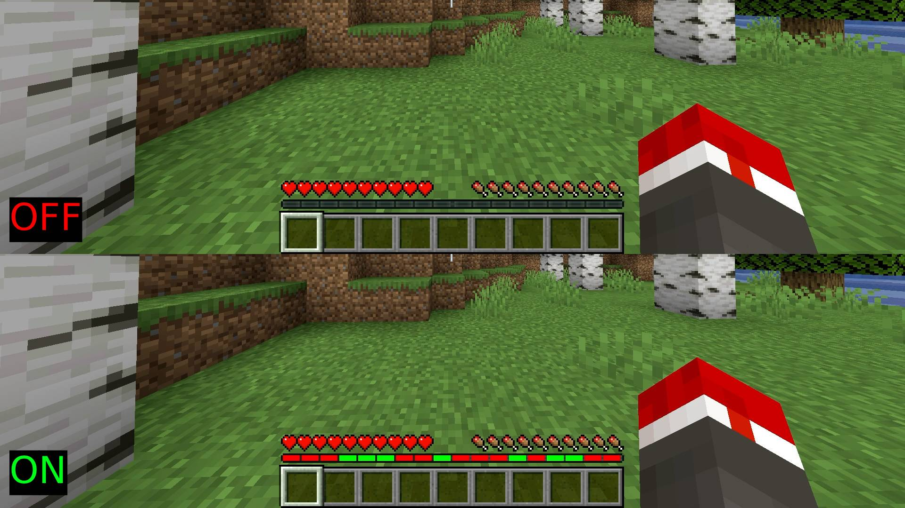

# XP Bar Ranked Overlay

> [!IMPORTANT]
> The script makes use of the live API, meaning it only works if you have your
> Twitch connected to your MCSR Ranked profile and are currently streaming on
> said connected channel.

> [!IMPORTANT]
> Overlay is currently positioned specifically for 1920x1080 on GUI 4.
> ([see issue](https://github.com/mcsr-tools/xp-bar-ranked-overlay/issues/4))

A proof of concept OBS script that adds an overlay for your XP bar to show your recent ranked matches.

Automatically hides the overlay when not in a match.

# Installation

1. Clone the repo or download the zip in releases
2. In OBS click on (+) in Tools -> Scripts
3. Select `xbro-obs-script.py`
4. Enter your MC name
5. Cick on **Generate scene**
6. Include the generated `xbro` scene in your gameplay scene as a source (make sure its above your capture source)
7. Toggle **Enable**
8. Done
